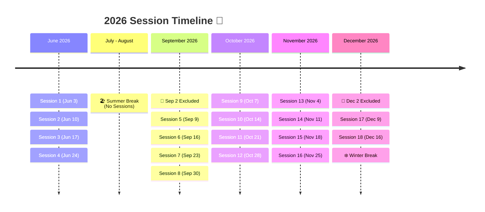

  <h1 style="margin: 0; color: white;">2026 Session Schedule</h1>
  <h3 style="margin: 5px 0 0 0; font-weight: normal; color: #F2A900;">University of British Columbia</h3>

 

## 📅 Schedule Overview
This is the calendar of sessions for the year 2026. 🚀

* **Start Date:** June 3rd, 2026
* **Holiday Exclusions:** This schedule **excludes** Summer Break (July & August), Winter Break (starting mid-December), and special exclusions on **September 2nd, 2026** and **December 2nd, 2026** (Excludes Summer, Sep 2, Dec 2, and Winter Break).

---

## 🗺️ Visual Timeline
Here is a quick map of how the sessions flow across the year:

---

## 📝 Detailed Session List

| Session # | Date | Status / Notes |
| :--- | :--- | :--- |
| **Session 1** | Wed, Jun 3, 2026 | 🚀 First Session |
| **Session 2** | Wed, Jun 10, 2026 | Active Session |
| **Session 3** | Wed, Jun 17, 2026 | Active Session |
| **Session 4** | Wed, Jun 24, 2026 | Last Session before Summer Break ☀️ |
| *Excluded* | Jul 1 – Aug 26, 2026 | 🏖️ **Summer Break** (No sessions) |
| *Excluded* | **Wed, Sep 2, 2026** | 🚫 **Special Exclusion** (No session) |
| **Session 5** | Wed, Sep 9, 2026 | 🎒 Welcome Back Session |
| **Session 6** | Wed, Sep 16, 2026 | Active Session |
| **Session 7** | Wed, Sep 23, 2026 | Active Session |
| **Session 8** | Wed, Sep 30, 2026 | Active Session |
| **Session 9** | Wed, Oct 7, 2026 | Active Session |
| **Session 10** | Wed, Oct 14, 2026 | Active Session |
| **Session 11** | Wed, Oct 21, 2026 | Active Session |
| **Session 12** | Wed, Oct 28, 2026 | Active Session |
| **Session 13** | Wed, Nov 4, 2026 | Active Session |
| **Session 14** | Wed, Nov 11, 2026 | Active Session |
| **Session 15** | Wed, Nov 18, 2026 | Active Session |
| **Session 16** | Wed, Nov 25, 2026 | Active Session |
| *Excluded* | **Wed, Dec 2, 2026** | 🚫 **Special Exclusion** (No session) |
| **Session 17** | Wed, Dec 9, 2026 | Active Session |
| **Session 18** | Wed, Dec 16, 2026 | ❄️ Last Session before Winter Break |
| *Excluded* | Dec 23, 2026 onward | 🎄 **Winter Break** (No sessions) |
