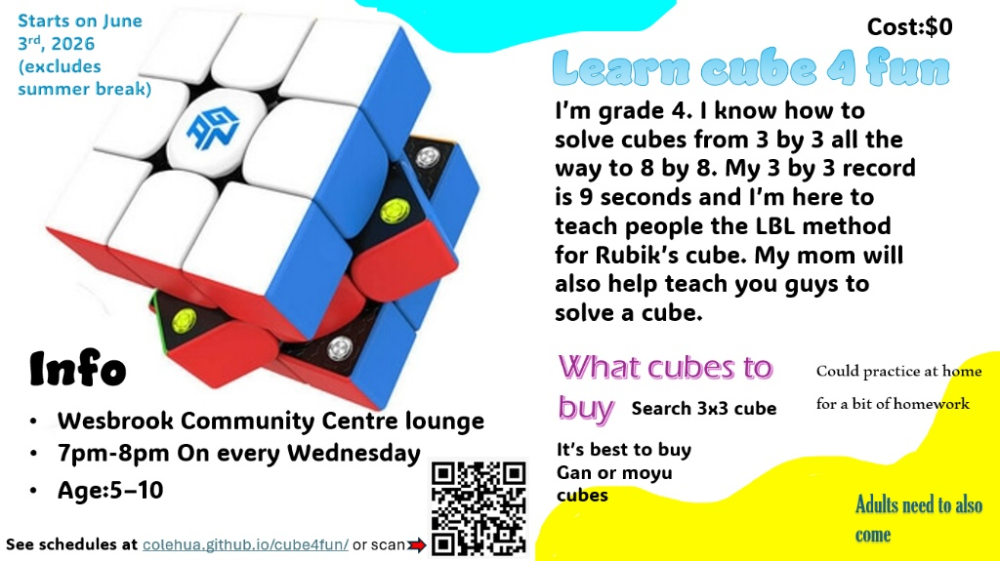

# 🧊 Cube4Fun

Welcome to **Cube4Fun**! We host fun, interactive, and easy-to-follow Rubik's Cube tutorials created by Cole.

📺 **[Subscribe to Cole's YouTube Channel! 🚀](https://www.youtube.com/@ColeHua)**
🏆 **[Check out Cole's WCA Profile! ⚡](https://www.worldcubeassociation.org/persons/2026HUAC01)**

Check out our website and interactive tutorials here: **[colehua.github.io/cube4fun](https://colehua.github.io/cube4fun/)**

## 📍 Session Info & Schedule
Join us for our free weekly sessions!
*   **Location:** Wesbrook Community Centre (Youth and Senior room OR Lounge)
*   **Time:** Wednesdays, 7:00 PM – 8:00 PM
*   **Age Group:** 5–10 years old (parents must accompany their children)

## 🌟 Learn Cube 4 Fun!
*With the LBL (Layer by Layer) method!*

We are constantly adding new tutorials for different cube sizes. The website is fully responsive, mobile-friendly, and features step-by-step videos for tricky algorithms!

## 🖼️ Original Flyer

## 🙏 Project Funded By
We gratefully acknowledge the **UBC Inspiring Community Grant** for their financial support of our project. You can learn more about the program at [inspired.ubc.ca](https://inspired.ubc.ca/).

